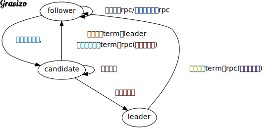

[TOC]

### 实验介绍

自lab2起,系列实验的最终目的:
构建一个具有容错功能的key-value存储系统

这个实验要实现Raft,一个副本状态机协议
下一个实验要基于这个协议构建一个key/value服务
然后把服务分片到多个副本状态机

一个副本服务通过在多个副本服务器上存储其状态的完整拷贝来实现容错
Replication允许系统中部分服务器出错的情况下(crashes or a broken or flaky network)服务仍然能够正常运行
服务器出错带来的问题之一就是,副本对原始数据存在着不同的拷贝

Raft管理一个服务的状态副本,尤其是它能帮助服务找出失败之后,哪个副本上的拷贝是正确的.
Raft实现了一个副本状态机,它把客户端的请求组织为一个有序串,把这个有序串称之为log
Raft确保所有的副本对log的内容达成一致
每个副本都会按照log中的顺序执行客户端的请求,并把这些请求作用于服务状态((service state))的本地拷贝
既然所有活着的副本看到相同内容的log内容,按相同顺序执行了相同的客户端请求,那么这些活着的副本就一直保持着同样的服务状态(service state)
如果某个服务器失败随后又恢复过来,那么Raft会负责把它的log的内容更新到最新状态
只有大多数服务器正常工作并能够互相通信,那么Raft就能一直工作
如果不存在这样的大多数,那么Raft无法继续工作,
?不过一旦又有了大多数机器恢复过来,那么Raft就能继续从原来的地方继续运行?

这个实验中,将要把Raft实现为Golang的一种自定义类型,这个类型关联一些methods
随后可以在key-value服务中使用这个模块
系统中的Raft类型的实例互相通过rpc通信来管理副本日志
自定义的Raft类型要支持 an indefinite sequence of numbered commands, also called log entries. 
The entries are numbered with index numbers. 
The log entry with a given index will eventually be committed. 
At that point, your Raft should send the log entry to the larger service for it to execute


这个实验中要实现extended-raft-paper中描述的几个方面:
saving persistent state and reading it after a node fails and then restarts
但不需要实现下边几个
cluster membership changes (Section 6) or log compaction / snapshotting (Section 7).

先理解extended-raft-paper和raft-lecture-notes再动手做实验.
你的实现要密切符合论文关于Raft的描述,尤其要关注论文中的 Figure 2.
关于Raft的实现,除了paper和lecture notes之外,还可以参考以下这些资料:

http://thesecretlivesofdata.com/raft/ Raft协议的图示
https://thesquareplanet.com/blog/students-guide-to-raft/
在并发程序中使用锁的建议 
https://pdos.csail.mit.edu/6.824/labs/raft-locking.txt
Raft并发程序的代码结构?
https://pdos.csail.mit.edu/6.824/labs/raft-structure.txt

For a wider perspective, have a look at Paxos, Chubby, Paxos Made Live, Spanner, Zookeeper, Harp, Viewstamped Replication, and Bolosky et al.


这个实验不需要写太多的代码,重点在于并发的代码难以调试.
### 关于代码

通过在raft/raft.go中添加代码来实现Raft算法
实现的Raft要支持下列这些接口
```go
rf := Make(peers,me,persister,applyCh)
rf.Start(command interface{}) (index,term,isLeader)
rf.GetState() (term,isLeader)
type ApplyMsg
```
tester和将来的key-value服务都会使用这些接口

一个服务通过调用`Make(peers,me,...)`来创建一个 Raft 实例
Make 的 peers 参数是一个数组,其中包含了集群中所有 Raft 实例的地址
Mkae 的 me 参数表明了自己在 peers 数组中的位置
通过调用`Start(command)`,让 Raft 启动把这个 command 添加到日志副本中的过程
这个调用立即返回,不用等待 Raft 完成 log append 动作
服务要求每次成功 commit 一个log entry 之后都要通过 `applyCh`这个channel发东一条 `ApplyMsg` 到其他 followers 

实现 Raft 的过程中应该使用 `labrpc` 这个 Go package 来提供 rpc 功能.
`labrpc` 这个 package 对 Golang 的 `pkg/net/rpc` 进行了修改,内部使用 Go channels 而不是 sockets
测试用例通过 `labrpc` 这个修改过的 package 可以延迟,重排,删除 rpc 调用,这样就能模拟各种网络异常的情况
通过模拟网络异常的情况,测试用例可以验证所实现的 Raft 能否在各种条件下保证一致性

 >Your first implementation may not be clean enough that you can easily reason about its correctness. Give yourself enough time to rewrite your implementation so that you can easily reason about its correctness. Subsequent labs will build on this lab, so it is important to do a good job on your implementation.
你写的代码一开始也许能够测试,但其结构并不清晰,并不足以用来证明它的正确性.花时间让代码既是正确的,也是结构清晰的.

### part2A
任务:**实现领导人选举和心跳功能**
(心跳就是没有 log entries 的 AppendEntries Rpc)

通过 `go test -run 2A`启动测试用例

#### 提示
+ 在Raft.go中为Rast struct添加任何必要的成员;定义一个struct来存放log entry;
+ 补充`RequestVoteArgs and RequestVoteReply`结构体;
在`Make`method中创建一个背景协程.
当Raft实例一段时间没有从其他实例收到心跳的时候,这个协程会通过`RequestVote`rpc来周期性的进行leader选举;
相应地,实现Raft的`RequestVote`method
+ 通过`AppendEntries`rpc来实现心跳机制,leader会周期性的发送这个rpc.
因此,要实现Raft的`AppendEntries`method
?so that other servers don't step forward as leaders when one has already been elected?
  - 确保每个Raft实例的`election timeouts`时间是不同的
+ 测试用例要求,leader在1s内发送心跳不超过10次
?为什么
+ 测试用例要求所实现的Raft遇到leader失败的情况时能够在5s内选出新的leader
因此,所选择的`election timeouts`时间要够短以保证能够在5s的一轮或多轮选举中选出leader
+ 论文中提到`election timeouts`在150-300ms内随机选取,这要求每150ms至少发起一次心跳
而测试用例要求1s内发送心跳不超过10次,因此实验中用的数值要比150-300大,而又不能太大
+ 可以使用`time.Timer和time.Ticket`来实现定时,和周期性的执行调用
+ 仔细阅读论文的figure2,选举的规则分散在figure2的各个部分


#### leader选举的核心要点
candidate [label="心跳等待超时,"];
  follower->follower [label="收到心跳rpc/或者收到投票rpc"];  
  candidate->leader[label="赢得多数票"];
  candidate->follower[label="发现当前term的leader\n或者收到更高term的rpc(心跳或投票)"];
  candidate->candidate [label="选举超时"];  
  leader -> follower [label="收到更高term的rpc(心跳或投票)"];
 }
'/>

理解并实现这个状态机
### part2B
在这个实验中我们要让Raft真正实现日志的一致性复制.Leader状态的Raft 实例通过调用`Start`函数来开始向log中添加log entry的过程,然后leader要通过`AppendEntries rpc`来把这个log entry发送给其他的服务器.

因此我们的代码的
任务:**实现leader和follower 添加log entry的功能**.
这涉及到完成`Start`函数,补充`AppendEntries`函数(2a中只是处理了心跳),处理leader的`commitIndex`变量.

#### 提示
+ 要实现5.4.1中提出的选举限制,即
`只有那些包含了所有已经commit的log entry的candidate才能被选举为leader`
这通过**follower只给log比自己更新的candidate投票**这个规则来实现
+ 代码中如果存在着不必要的选举会无法通过lab 2b的测试.不必要的选举指的是,在系统中存在着活的leader的情况下还在举行着选举.这可能是因为选举计时器出了bug,也可能是因为leader选出来之后没有及时发送心跳.
+ 代码中要实现等待某个事件发生的功能.不要用循环忙等,要么使用golang的channel,要么使用条件变量,实在不行也要在loop在插入sleep的代码.
+ 要花时间利用`structuring concurrent code`中学到的知识来重构代码.
后边的实验中你会因为这里的代码清晰简洁而感谢自己的.

如果代码写的太差导致代码运行的慢也会无法通过测试.可以通过time命令来了解自己的代码,它会告诉你,你的代码总共用了多少时间,除去waitting/sleeping之外,实际执行指令的部分用了多少时间.
如果你的代码总时间超过1分钟或指令执行部分超过5s,那么都会无法通过测试.


### part2C
### 附录
#### Figure2&3 in paper

#### students-guide-to-raft/
https://thesquareplanet.com/blog/students-guide-to-raft/
#### Raft Locking 
在并发程序中使用锁的建议 
https://pdos.csail.mit.edu/6.824/labs/raft-locking.txt

#### Raft Structure
Raft并发程序的代码结构?
https://pdos.csail.mit.edu/6.824/labs/raft-structure.txt
